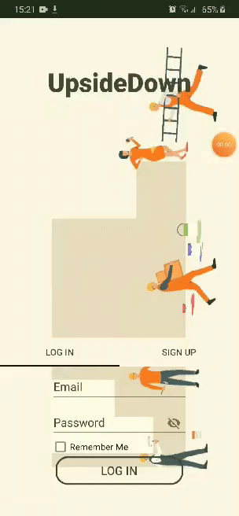
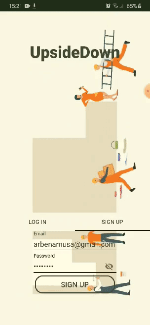
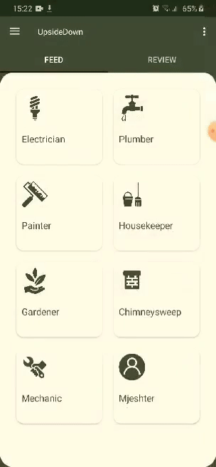
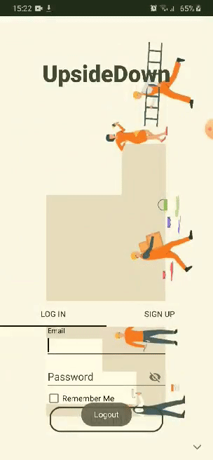
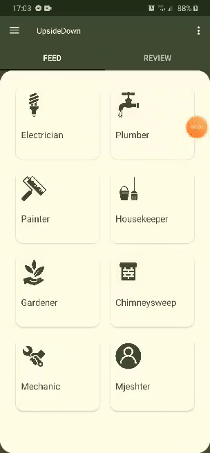
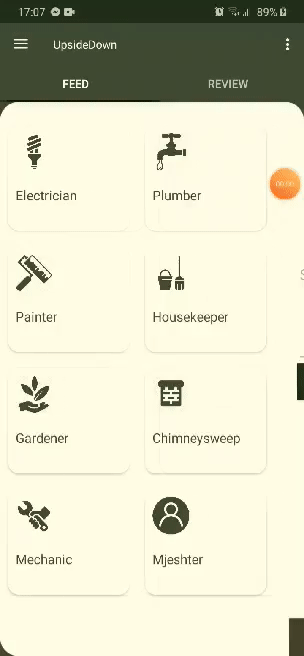

# UpsideDown

Ideja që fshihet pas këtij projekti është lehtësimi i vendojes së kontaktit të klientëve me cilëndo kategori të mirëmajtësve.

## Kërkesat teknike të projektit

- [x] Me shume se nje aktivitet
    + AuthActivity
    + RegisterActivity
    + MainActivity
    + FeedActivity
    + AsyncActivity
    + MapsActivity
- [x] Fragmente dhe menaxhim me to
    + Menaxhimi përmes navgraph
        + Feed1Fragment
        + Feed2Fragment
    + Menaxhimi përmes ViewPager dhe Tabs
        + LoginFragment
        + SignupFragment
        + FeedFragment
- [x] Konfigurim te permission ne manifest
    + INTERNET
    + ACCESS_NETWORK_STATE
    + CAMERA
    + CALL_PHONE
    + WRITE_EXTERNAL_STORAGE
    + READ_EXTERNAL_STORAGE
    + ACCESS_FINE_LOCATION
- [x] Se paku nje layout linear, relative dhe constraint layout 
- [x] Parsim te JSON
    + assests/occupation.json => Feed1Fragment (Gjenerimi dinamik i jobList dhe përshkrimeve të tyre)
- [x] Pune me shume threada permes AsyncTask
    + AsyncActivity (Nxjerrja e listës së përdoruesve të regjistruar në aplikacion nga pajisja aktuale)
- [ ] Se paku nje librari te jashtme
- [x] Nje databaze te brendshme
    + SQLite database që ruan të gjithë përdoruesit e regjistruar nga pajisja aktuale
- [x] Shared preferences 
    + Remenber me (ruan email dhe password edhe pasi një përdorues bëhet logout)
- [x] Integrim me nje nga sherbimet e Firebase
    + Firebase Authentication
    + Firebase Database (Ruajta e profilit të përdoruesit dhe feedback)
    + Firebase Storage (Ruajtja e fotos së profilit të përdoruesit)
- [x] Menu, Tabs
    + nav_menu
    + side_menu
- [x] Toasts dhe Snackbars
- [x] Animacione bazike
    + blink
    + fadein
- [x] Pershtatje per madhesi te ndryshme te ekranit
    + sw480dp
    + sw600dp
    + sw720dp
    + landscape

Bonus:
- [x] Komunikimi me pjese harduerike te telefonit
    + android.hardware.camera
    + andorid.hardware.camera.autofocus
    + android.hardware.camera.flash
- [ ] Implementimi i hartave [me cluster]

## Implementimi i kërkesave

|  |  |  |  |
| :---: |:---:| :---: | :---: |
| *Regjistrimi i një përdoruesi të ri* | *Regjistrimi i profilit të përdoruesit*| *Logout* | *Kyçja e përdoruesit ekzistues* |
  
  
|  |  |
| :---: |:---:|
| *Kërkimi i një punëtori* | *Dërgimi i feedback për aplikacionin* |