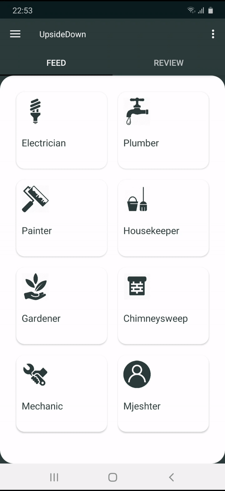

# UpsideDown

 

Jeni duke e kërkuar me orë të tëra një instalues uji, kopshtar, elektricist, apo një tjetër mjeshtër dhe nuk e gjenë dot një të tillë që është i duhuri apo që ka kohë për të kryer punën që ju keni nevojë...?!

Me përdorimin e aplikacionit tonë UpsideDown do të keni mundësi të shihni listën e të gjithë atyre personave që janë adekuatë për punën e tyre dhe do të mund të komunikoni me ta e të gjeni zgjidhje të shpejtë.
Pra, jo më duke kërkuar lartë e poshtë për të gjetur mjeshtrin që juve ju duhet!

Ideja e aplikacionit tonë ka të bëjë me lehtësimin e kontaktimit të klientëve dhe disa kategorive të caktuara që ofrojnë shërbime për mirëmbajtjen e shumë
gjërave në shtëpitë tona, e që mund ti përmendim disa prej tyre siq janë: elektricistët, kopshatarët, instaluesit e ujit, amvise, e shumë të tjerë...
Aplikacioni ynë do të mundësojë që shfrytëzuesit e këtij aplikacioni të kenë lehtë të qasshme të gjitha këto kategori dhe informatat për të komunikuar
me të gjithë personat që ofrojnë këto shërbime duke ua lehtësuar jetën dhe duke ua kursyer kohën, në këtë rast të dy palëve si klientëve ashtu edhe ofruesve të këtyre shërbimeve.

## Kërkesat teknike të projektit

- [x] Me shume se nje aktivitet
    + AuthActivity
    + RegisterActivity
    + MainActivity
    + FeedActivity
    + AsyncActivity
    + MapsActivity
- [x] Fragmente dhe menaxhim me to
    + Menaxhimi përmes navgraph
        + Feed1Fragment
        + Feed2Fragment
    + Menaxhimi përmes ViewPager dhe Tabs
        + LoginFragment
        + SignupFragment
        + FeedFragment
- [x] Konfigurim te permission ne manifest
    + INTERNET
    + ACCESS_NETWORK_STATE
    + CAMERA
    + CALL_PHONE
    + WRITE_EXTERNAL_STORAGE
    + READ_EXTERNAL_STORAGE
    + ACCESS_FINE_LOCATION
- [x] Se paku nje layout linear, relative dhe constraint layout 
- [x] Parsim te JSON
    + assests/occupation.json => Feed1Fragment (Gjenerimi dinamik i jobList dhe përshkrimeve të tyre)
- [x] Pune me shume threada permes AsyncTask
    + AsyncActivity (Nxjerrja e listës së përdoruesve të regjistruar në aplikacion nga pajisja aktuale)
- [x] Se paku nje librari te jashtme
- [x] Nje databaze te brendshme
    + SQLite database që ruan të gjithë përdoruesit e regjistruar nga pajisja aktuale
- [x] Shared preferences 
    + Remenber me (ruan email dhe password edhe pasi një përdorues bëhet logout)
- [x] Integrim me nje nga sherbimet e Firebase
    + Firebase Authentication
    + Firebase Database (Ruajta e profilit të përdoruesit dhe feedback)
    + Firebase Storage (Ruajtja e fotos së profilit të përdoruesit)
- [x] Menu, Tabs
    + nav_menu
    + side_menu
- [x] Toasts dhe Snackbars
- [x] Animacione bazike
    + blink
    + fadein
- [x] Pershtatje per madhesi te ndryshme te ekranit
    + sw480dp
    + sw600dp
    + sw720dp
    + landscape

Bonus:
- [x] Komunikimi me pjese harduerike te telefonit
    + android.hardware.camera
    + andorid.hardware.camera.autofocus
    + android.hardware.camera.flash
- [x] Implementimi i hartave [me cluster]

## Implementimi i kërkesave

|  |  |  |  | 
| :---: | :---: | :---: | :---: | 
| *Regjistrimi i një përdoruesi të ri* | *Regjistrimi i profilit të përdoruesit*| *Logout* | *Kyçja e përdoruesit ekzistues* |
  
Regjistrimi dhe kyçja e përdoruesve ëstë bërë duke përdorur Firebase Authentication, profili i përdoruesit ruhet në Firebase Database, ndërsa fotoja e profilit ruhet në Firebase Storage.
  
| |  |  |  | | 
| :---: | :---: | :---: | :---: | :---: |
| *AsyncTask* | *Lista e punonjësve* | *App feedback* | *User profile* | *Shared preferences* |

Përmes AsyncTask nxjerret nga të dhënat e ruajtura në databazën lokale lista e të gjithë përdoruesve të regjistruar nga pajisja aktuale, ndërsa në feedback ruhet në Firebase Database. Remember Me i ruan email dhe password në Shared preferences.

## Bonus

| | |
| :---: | :---: |
| *Komunikimi me pjesë harduerike* | *Implementimi i clustered maps* |

## Members

[Arbena Musa](https://github.com/ArbenaMusa)

[Medina Krelani](https://github.com/MedinaKrelani)
